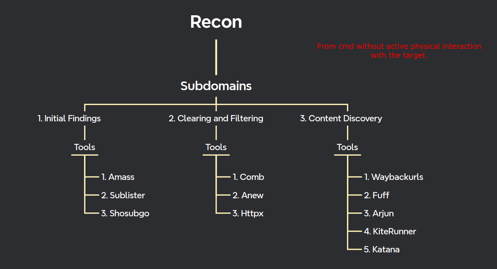

# Personal Recon Framework
> Bug Hunting

-------

1. Initial Findings
	First use amass to gather a list of available subdomains
	Then sublister
	and last shosubgo

2. Clearing and Filtering
	Parse out the subdomains from output files of the previous tools
	then filter out all the uniq subdomains from all of the subdomains file
	and lastly use `httx` to parse out the live hosts from available subdomains

3. Content Discovery
	Use waybackurls to get the urls from all the live hosts
	(use ffuf for content discovery like parameters or files, arjun and katana as well)
	and kite runner to map out the entire application as it's a spidering framework.

